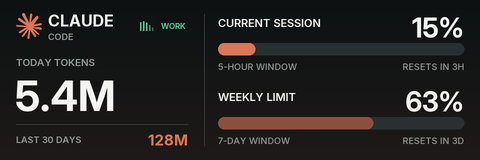

# KVM AI Monitor

Turn a GL.iNet Comet Pro KVM's touchscreen into a live AI-usage dashboard. The KVM renders a
480×160 wallpaper showing your AI subscription usage — Claude Code's account-accurate current
session, weekly, and model-scoped limits, Codex plan windows and daily tokens — plus an
animated working indicator whenever an agent is actively processing on any enrolled device.

- Everything renders on the KVM itself; your computers never run a dashboard, server, or open
  port. Enrolled devices push signed, whitelisted usage aggregates outbound; credentials never
  leave the device they live on.
- Works across devices and accounts: enroll any number of macOS, Linux, or Windows machines,
  and one machine can push to several KVMs.
- The KVM's primary job always wins: the animation pauses automatically while anyone is
  remote-viewing, and the agent runs at low priority.
- Copilot, Gemini CLI, and Grok get installation/sign-in detection; their vendors expose no
  supported consumer quota API yet.



## Prerequisites

- A GL.iNet Comet Pro with its admin password (2FA supported), reachable on your LAN.
- A macOS, Linux, or Windows machine with Node.js 22+ to run the setup wizard. On Windows you
  also need [Git for Windows](https://git-scm.com/download/win) (the agent installer needs its
  bundled `bash`/`tar`/`base64`), and the session token is stored in Windows Credential Manager
  instead of the Keychain.
- On Linux, `secret-tool` and an unlocked user keyring for securely storing the KVM session
  token (on Debian/Ubuntu: `sudo apt install libsecret-tools`).
- On each monitored device: Python 3 and the AI provider CLIs you want to monitor installed and
  signed in (for example, Claude Code or Codex). Claude and Codex provide usage data; Copilot,
  Gemini CLI, and Grok currently provide install/sign-in and activity detection only.
- On Windows, Microsoft Store `python`/`python3` aliases are often non-runnable stubs. The setup
  automatically finds Python installed from [python.org](https://www.python.org/downloads/)
  (even when it was not added to `PATH`), `uv python install`, or the Python launcher. For a
  custom location, set `KVM_PYTHON` to the full path of `python.exe`.

## Install

Run the guided setup on any macOS, Linux, or Windows computer on the same network as the Comet.

### Recommended: one command with npx

With Node.js 22+ installed, no clone or install is needed — run the setup wizard straight from
GitHub:

```bash
npx github:ivangong24/kvm_AI_monitor
```

It discovers the Comet, signs in (keeping only a revocable session token), installs the on-device
agent, switches the touchscreen to Wallpaper Only, and enrolls this machine — the same flow as
`npm run setup` below.

### Homebrew

Homebrew is supported on macOS and Linux:

```bash
brew install ivangong24/kvm-ai-monitor/kvm-ai-monitor
kvm-ai-monitor
```

### Classic installation

```bash
git clone https://github.com/ivangong24/kvm_AI_monitor.git
cd kvm_AI_monitor
npm install
npm run setup
```

The wizard discovers the Comet, signs in (only a revocable session token is kept, in your
Keychain, Windows Credential Manager, or Linux libsecret keyring), installs the on-device
agent, switches the touchscreen to Wallpaper Only, enrolls the machine it runs on as a push
device (macOS, Windows, or Linux, with optional Claude Code hooks for exact working-state
animation), and finishes with a health check.

The management commands (`npm run helper:install`, `helper:status`, `helper:hooks`,
`kvm:agent:install`, …) run on all three platforms — a Node dispatcher selects the right
implementation and finds Git Bash / a runnable Python for you on Windows.

Usage from every enrolled device is summed on the KVM: daily token totals add up across
machines, while plan and percentage limits come from the most recent push (they describe the
Anthropic account, not the device, so they are not additive).

### Enrolling more devices

On the AI Usage page (`https://<comet-ip>/extras/ai-usage/`), use **Enroll a device** to get a
device ID and one-time secret, then on that device run:

```bash
# macOS
./helper/install-helper.sh --kvm <comet-ip> --device <device-id>

# Linux (systemd user session)
./helper/install-helper-linux.sh --kvm <comet-ip> --device <device-id>

# Windows (PowerShell; finds python.org, uv, and py-launcher interpreters automatically)
powershell -ExecutionPolicy Bypass -File helper\install-helper.ps1 -Kvm <comet-ip> -Device <device-id>
```

Each installer schedules a per-minute usage push (LaunchAgent / systemd timer / Task
Scheduler) and stores the secret in the platform vault (Keychain / libsecret / Windows DPAPI).
On macOS it also schedules a lightweight activity poller that animates the working indicator for
every provider — **including Claude** — without touching your editor config. Claude Code
lifecycle hooks are **optional and off by default**; they only tighten the timing, and the
installer prints the opt-in command (you can also toggle them from the menu bar app's Settings).
Details: [`helper/README.md`](helper/README.md).

Each scheduler runs in the logged-in user's session, so pushes pause while that user is signed
out (the desktop is not counted until the next sign-in); they resume automatically. On Windows,
`npm run helper:status` reads the scheduled task's `LastTaskResult` (`0` = last push succeeded).

Optionally, a device can instead be read over SSH ("Connected device" on the page): enable
Remote Login, authorize the KVM's public key, and enter the username. SSH devices provide
install/auth detection and working-state presence; push devices provide full usage and are the
recommended path.

## Usage

Manage everything at `https://<comet-ip>/extras/ai-usage/`:

- **Display provider** — choose which subscription the touchscreen shows (Claude, Codex, …),
  each with its own brand colors and working-glyph animation.
- **Appearance** — customize the selected provider's wallpaper colors, working-glyph style, and
  whether limit rows lead with percent used or time to reset, with an instant live preview;
  themes are validated JSON stored on the KVM (export/import supported, one-click reset).
- **Layouts** — pick a wallpaper arrangement (Classic, Detailed with a 7-day sparkline and
  reset countdown, Compact with a clock, Multi-agent showing every provider's usage at once) or
  build a custom one by assigning widgets — limit bars, token totals, sparkline, countdown,
  clock, provider grid, plan — to named slots.
- **Push devices** — enroll, rotate secrets, revoke, or delete devices; last-seen times shown.
- **Display settings** — enable/disable the wallpaper, working animation, and refresh interval.
- **Dashboard** — a crisp, animated preview of the touchscreen, rebuilt live in the browser as
  vectors (not an upscaled screenshot) with the per-provider working glyph animating in real
  time, plus device health.
- **Updates** — the page shows the agent version and checks GitHub releases on demand; update
  a Homebrew install with `brew upgrade kvm-ai-monitor && kvm-ai-monitor install-agent`, or a
  classic install with `git pull && npm install && npm run kvm:agent:install`.

The wallpaper shows current-session and weekly limit bars with reset times, today's and
30-day token totals, and animates while the selected agent is working on any enrolled device
(120-second activity window; tightest per-turn timing when the optional Claude hooks are
installed). Usage data is retained while a device is offline; the animation pauses during active
remote viewing (`pauseWhenStreaming`).

The macOS menu bar companion gives this Mac a compact control surface: a plain-language status
summary, your Comet Pro with a link to open its screen, **Update now** / **Add or fix a device**
actions, and a **Settings** page (open at login, plus an opt-in toggle for precise Claude
working-state hooks). Build it with `./desktop/build.sh` and open the resulting
`desktop/dist/KVM AI Monitor.app` — see [`desktop/README.md`](desktop/README.md). A signed
Homebrew cask (`brew install --cask kvm-ai-monitor`) is planned once the app is Developer
ID–signed and notarized; until then, build from source.

## Privacy

Push payloads contain only plan label, quota percentages, reset times, and daily token
counts — never prompts, responses, paths, project names, emails, or credentials. Every push is
HMAC-signed with a revocable per-device secret; the OAuth token used to read Claude's account
limits stays in memory on the device that owns it. Inspect exactly what would be sent with
`npm run helper:status`. Full protocol: [`docs/PUSH_PROTOCOL.md`](docs/PUSH_PROTOCOL.md).

## Uninstall

```bash
npm run kvm:agent:uninstall    # remove the KVM extension (config preserved on the KVM)
npm run helper:uninstall       # remove this device's helper (--purge also removes secrets)
```

## Development

```bash
npm test                          # Node: Comet client, CLI, HMAC vector, PowerShell config merge
npm run helper:test               # helper unit tests (also run on Linux/Windows in CI)
python3 kvm-agent/test_push_receiver.py
python3 kvm-agent/test_ssh_collector.py
```

The Node suite's PowerShell config-merge tests run against `powershell.exe` on Windows and
`pwsh` elsewhere when present; they skip with a reason when no PowerShell is installed.

To preview the AI Usage web console without a Comet, run `python3 kvm-agent/preview-web.py` and
open http://127.0.0.1:8787 — it serves `index.html` with realistic mock API data (including a
"working" state so the live touchscreen animation runs). It never talks to a real KVM or device.

CI runs the suite on macOS, Ubuntu, and Windows. Design history and device internals are in
[`docs/PROJECT_CHECKPOINT_2026-07-18.md`](docs/PROJECT_CHECKPOINT_2026-07-18.md); future
directions in [`docs/ROADMAP.md`](docs/ROADMAP.md).
