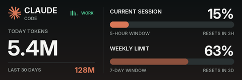

# KVM AI Monitor

Turn a GL.iNet Comet Pro KVM's touchscreen into a live AI-usage dashboard. The KVM renders a
480×160 wallpaper showing your AI subscription usage — Claude Code's account-accurate current
session, weekly, and model-scoped limits, Codex plan windows and daily tokens — plus an
animated working indicator whenever an agent is actively processing on any enrolled device.

- Everything renders on the KVM itself; your computers never run a dashboard, server, or open
  port. Enrolled devices push signed, whitelisted usage aggregates outbound; credentials never
  leave the device they live on.
- Works across devices and accounts: enroll any number of macOS, Linux, or Windows machines,
  and one machine can push to several KVMs.
- The KVM's primary job always wins: the animation pauses automatically while anyone is
  remote-viewing, and the agent runs at low priority.
- Copilot, Gemini CLI, and Grok get installation/sign-in detection; their vendors expose no
  supported consumer quota API yet.



## What you need

- A **GL.iNet Comet Pro** with its admin password (2FA supported), reachable on your LAN.
- On each computer you want to track: **Python 3** and the AI provider CLIs you use, installed and
  signed in. Claude Code and Codex report full usage; Copilot, Gemini CLI, and Grok report
  install/sign-in and activity only (their vendors expose no consumer quota API yet).
- For the **macOS companion app**: [Homebrew](https://brew.sh) — the app uses it to install its
  small command-line helper for you.
- For the **command-line setup** (Linux, Windows, or Macs without the app): **Node.js 22+**, plus
  the [platform notes](#platform-notes) below.

## Set up with the companion app (macOS — the easy way)

The menu-bar companion is the simplest way in. Install it, click **Set up**, and it does the
rest — finds your Comet, signs you in, installs the on-device agent, switches the touchscreen to
Wallpaper Only, and enrolls this Mac. No commands to copy.

**1. Install the app**

- Download `KVM-AI-Monitor-v<latest>.zip` from the
  [latest release](https://github.com/ivangong24/kvm_AI_monitor/releases/latest), unzip it, and
  move **KVM AI Monitor.app** to your Applications folder. (Until the app is notarized, the first
  launch needs right-click → **Open** to get past Gatekeeper.)
- Or with Homebrew: `brew install --cask ivangong24/kvm-ai-monitor/kvm-ai-monitor`.

**2. Open it and click *Set up***

The app installs its `kvm-ai-monitor` helper and walks you through connecting the Comet. When
prompted, enter the Comet admin password (and 2FA code, if enabled) and **give this Mac a name**.
Usage starts pushing to the touchscreen within a minute — no manual helper commands.

**3. Manage everything from the app**

- **Home** — a plain-language status summary, your Comet Pro's health, a link to open its screen,
  and **Update now** to push immediately.
- **Add or fix a device** — re-runs setup to (re-)enroll this Mac, redeploy the agent, or repair a
  connection.
- **Settings** — which terminal to use for setup, open-at-login, push interval, an opt-in toggle
  for precise Claude Code working-state hooks, and app updates: it checks GitHub for new releases
  automatically and **Get update** downloads and installs them in place.

To add another Mac, install the app on it and click **Set up** there too.

## Set up from the command line (Linux, Windows, or without the app)

Any macOS/Linux/Windows machine on the Comet's network can run the same guided wizard. Pick one:

```bash
# One-off with npx (Node 22+, no clone)
npx github:ivangong24/kvm_AI_monitor

# Homebrew (macOS/Linux)
brew install ivangong24/kvm-ai-monitor/kvm-ai-monitor && kvm-ai-monitor

# From a clone
git clone https://github.com/ivangong24/kvm_AI_monitor.git
cd kvm_AI_monitor && npm install && npm run setup
```

The wizard discovers the Comet, signs in (keeping only a revocable session token — in your
Keychain, Windows Credential Manager, or Linux libsecret keyring), installs the on-device agent,
switches the touchscreen to Wallpaper Only, enrolls the machine it runs on (you name it, with
optional Claude Code hooks), and finishes with a health check.

### Enrolling more devices from the command line

The companion app enrolls the Mac it runs on; to enroll a **Linux or Windows** box (or a Mac
without the app), open the AI Usage page (`https://<comet-ip>/extras/ai-usage/`) → **Enroll a
device** for a device ID and one-time secret, then run on that device:

```bash
# macOS
./helper/install-helper.sh --kvm <comet-ip> --device <device-id>

# Linux (systemd user session)
./helper/install-helper-linux.sh --kvm <comet-ip> --device <device-id>

# Windows (PowerShell; finds python.org, uv, and py-launcher interpreters automatically)
powershell -ExecutionPolicy Bypass -File helper\install-helper.ps1 -Kvm <comet-ip> -Device <device-id>
```

Each installer schedules a per-minute usage push (LaunchAgent / systemd timer / Task Scheduler)
and stores the secret in the platform vault (Keychain / libsecret / Windows DPAPI). It runs in the
logged-in user's session, so pushes pause while that user is signed out and resume on sign-in.
Details: [`helper/README.md`](helper/README.md). The management commands
(`npm run helper:status`, `helper:hooks`, `kvm:agent:install`, …) work on all three platforms.

Alternatively a device can be read over **SSH** ("Connected device" on the page): enable Remote
Login, authorize the KVM's public key, and enter the username. SSH devices provide install/auth
and working-state presence; push devices provide full usage and are the recommended path.

### Platform notes

- **Windows** also needs [Git for Windows](https://git-scm.com/download/win) (the agent installer
  uses its bundled `bash`/`tar`/`base64`). Microsoft Store `python`/`python3` aliases are often
  non-runnable stubs; setup automatically finds Python from
  [python.org](https://www.python.org/downloads/) (even if not on `PATH`), `uv python install`, or
  the Python launcher. Set `KVM_PYTHON` to a full `python.exe` path to override.
- **Linux** needs `secret-tool` and an unlocked user keyring for the session token (Debian/Ubuntu:
  `sudo apt install libsecret-tools`).

## What shows up, and the web console

Usage from every enrolled device is summed on the KVM: daily token totals add across machines,
while plan and percentage limits come from the most recent push (they describe the account, not the
device, so they aren't additive). The wallpaper shows current-session and weekly limit bars with
reset times, today's and 30-day token totals, and animates while the selected agent is working on
any enrolled device (120-second activity window; tightest timing with the optional Claude hooks).
Usage is retained while a device is offline, and the animation pauses during active remote viewing.

Beyond the companion app, the on-KVM console at `https://<comet-ip>/extras/ai-usage/` offers deeper
customization:

- **Display provider** — choose which subscription the touchscreen shows (Claude, Codex, …).
- **Appearance** — the selected provider's colors, working-glyph style, and whether limit rows lead
  with percent used or time to reset, with a live preview; themes are validated JSON (export/import,
  one-click reset).
- **Layouts** — Classic, Detailed (7-day sparkline + reset countdown), Compact (with clock),
  Multi-agent (every provider at once), or a custom layout built from widgets.
- **Push devices** — enroll, rotate secrets, revoke, or delete devices, with last-seen times.
- **Display settings** — toggle the wallpaper, working animation, and refresh interval.
- **Dashboard** — a crisp, live vector preview of the touchscreen plus device health.

## Privacy

Push payloads contain only plan label, quota percentages, reset times, and daily token
counts — never prompts, responses, paths, project names, emails, or credentials. Every push is
HMAC-signed with a revocable per-device secret; the OAuth token used to read Claude's account
limits stays in memory on the device that owns it. Inspect exactly what would be sent with
`npm run helper:status`. Full protocol: [`docs/PUSH_PROTOCOL.md`](docs/PUSH_PROTOCOL.md).

## Uninstall

To stop a Mac from pushing, quit and drag **KVM AI Monitor.app** to the Trash, then remove its
helper. To take the dashboard off the KVM entirely, remove the on-device agent:

```bash
npm run helper:uninstall       # remove this device's helper (--purge also removes secrets)
npm run kvm:agent:uninstall    # remove the KVM extension (config preserved on the KVM)
```

## Development

```bash
npm test                          # Node: Comet client, CLI, HMAC vector, PowerShell config merge
npm run helper:test               # helper unit tests (also run on Linux/Windows in CI)
python3 kvm-agent/test_push_receiver.py
python3 kvm-agent/test_ssh_collector.py
```

The Node suite's PowerShell config-merge tests run against `powershell.exe` on Windows and
`pwsh` elsewhere when present; they skip with a reason when no PowerShell is installed.

To preview the AI Usage web console without a Comet, run `python3 kvm-agent/preview-web.py` and
open http://127.0.0.1:8787 — it serves `index.html` with realistic mock API data (including a
"working" state so the live touchscreen animation runs). It never talks to a real KVM or device.

CI runs the suite on macOS, Ubuntu, and Windows. Design history and device internals are in
[`docs/PROJECT_CHECKPOINT_2026-07-18.md`](docs/PROJECT_CHECKPOINT_2026-07-18.md); future
directions in [`docs/ROADMAP.md`](docs/ROADMAP.md).
